# RhidProcess

## O que é este projeto?

Este projeto é uma API construída com ASP.NET que automatiza um fluxo de desbloqueio no portal RHID utilizando um navegador headless via Puppeteer.

Ele recebe um serial e uma senha, realiza o login na plataforma, navega até a tela de desbloqueio e retorna a contra-senha obtida.

## O que a API faz

A API expõe um endpoint para executar esse processo:

- GET /v2/rhid/unlock
  - Parâmetros de query:
    - serial
    - password
  - Retorno: um objeto com a propriedade contraSenha

Fluxo interativo da requisição:

```mermaid
flowchart LR
    Client[Cliente] -->|1. envia serial e senha| Sistema[API ASP.NET]
    Sistema -->|2. valida chave| Auth[Middleware de API Key]
    Auth -->|3. autorizado| Automacao[Serviço de Automação]
    Automacao -->|4. navega no portal| Browser[Navegador Headless]
    Browser -->|5. realiza login e desbloqueio| Rhid[Portal RHID]
    Rhid -->|6. retorna resultado| Browser
    Browser -->|7. entrega contra-senha| Automacao
    Automacao -->|8. responde ao cliente| Sistema
    Sistema -->|9. retorno final| Client

    classDef highlight fill:#4ade80,stroke:#15803d,stroke-width:3px,color:#000,font-weight:bold
    class Auth highlight
```



Também existe um endpoint de verificação:

- GET /v2/health
  - Retorna "healthy" quando a API está disponível

## Como usar

1. Suba a aplicação rodando
```bash
docker compose up
```
3. Envie uma requisição com a chave de API no header X-Api-Key.
4. Informe os dados necessários no endpoint de desbloqueio.

Exemplo:

```bash
curl -H "X-Api-Key: sua-chave" "http://localhost:4563/v2/rhid/unlock?serial=123456&password=minhasenha"
```

## Configuração necessária

A aplicação exige uma chave de API para acessar os endpoints.

### Configuração da API key

A chave pode ser configurada via variável de ambiente:

- ApiKey

No Docker Compose, isso é feito através do arquivo .env, por exemplo:

```env
API_KEY=minha-chave-secreta
```

Também é possível definir a chave no arquivo appsettings.Development.json para ambiente local.

### Logs de erro

No Docker Compose, os logs são gravados em `./Logs` no host e montados em `/app/Logs` no container.
Defina `LOGS_PATH` no arquivo `.env` para usar outro diretório do host.

